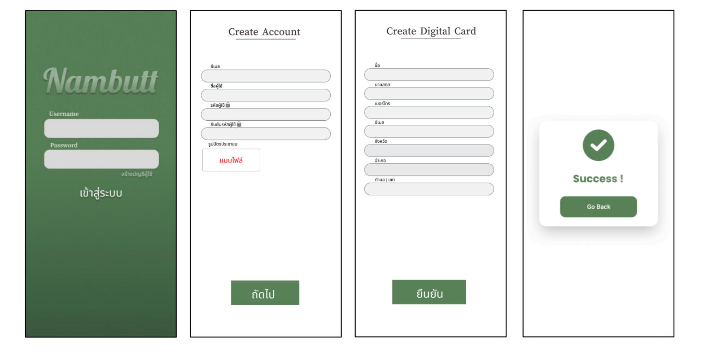
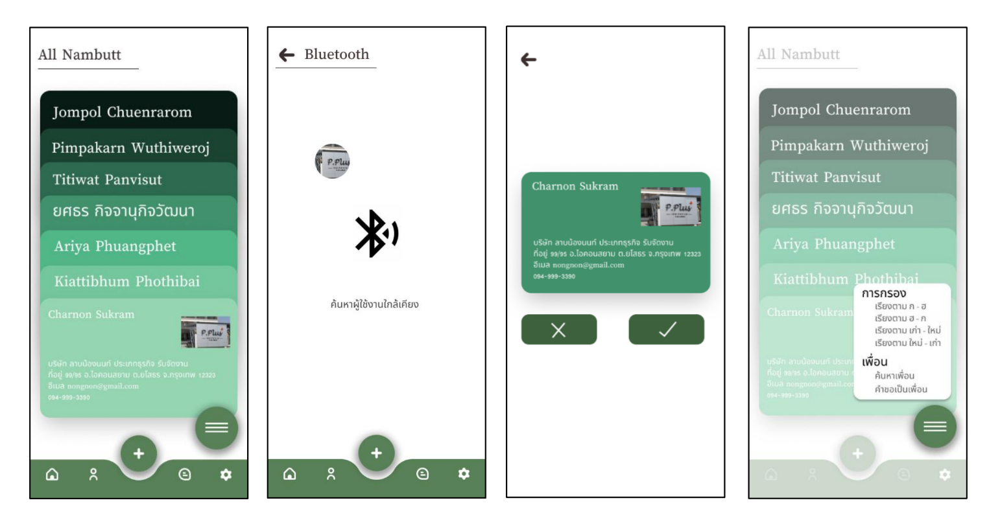
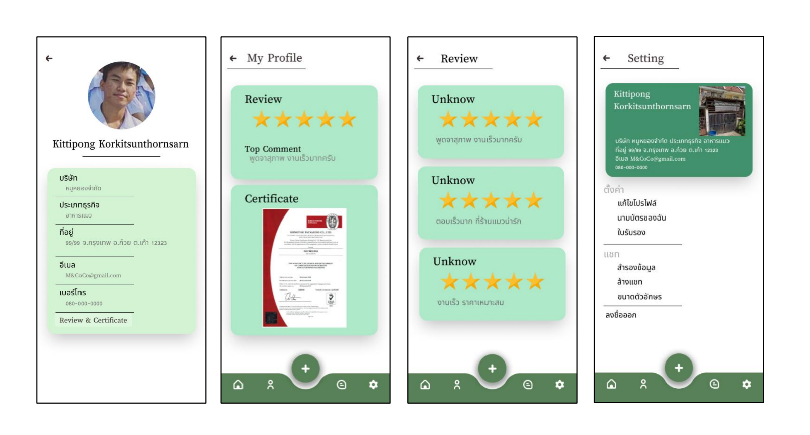
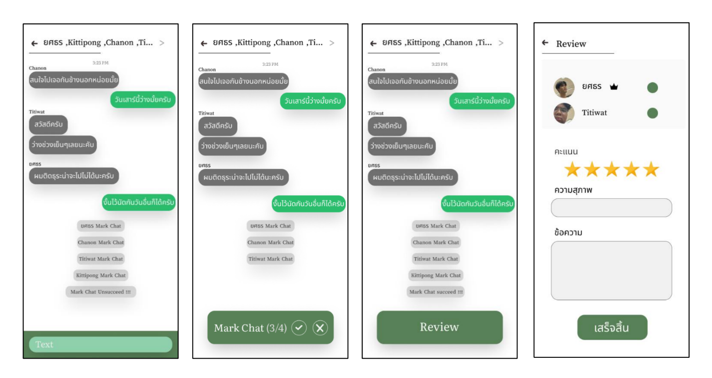

# 📌 ระบบสารสนเทศนามบัตรดิจิทัล  

โครงงานนี้เป็นส่วนหนึ่งของรายวิชา **การวิเคราะห์และออกแบบระบบ (System Analysis and Design)**  
วัตถุประสงค์เพื่อฝึกวิเคราะห์ความต้องการ ออกแบบกระบวนการ และสร้างโมเดลเชิงระบบของแอปพลิเคชันจริง  

---

## 🎯 สิ่งที่ทำ
- วิเคราะห์ **Requirement** ของระบบนามบัตรดิจิทัล  
- ออกแบบ **Data Flow Diagram (DFD)** ครอบคลุม 11 Process  
- จัดทำ **Data Dictionary** ของกระแสข้อมูลและแหล่งเก็บข้อมูล  
- ออกแบบ **ER-Diagram** และแปลงเป็น **Relational Database Model**  
- ทำ **Normalization (1NF → 3NF)**  
- จัดทำ **UI/UX Mockup** เพื่อแสดงตัวอย่างหน้าจอระบบ และ สร้าง Prototype, Component และ Flow ของผู้ใช้งาน

---

## 🔗 ลิงก์ไปยังงานออกแบบ
👉 [เปิดดูใน Figma](https://www.figma.com/design/dsOon1dN5dF4SriokJSXGg/NAMBUUT-APP-Design?m=auto&t=3IH0oK311WQtjHu1-6)

---

## 📸 ตัวอย่างหน้าจอ

### 🔑 การเข้าสู่ระบบ

### 🏠 หน้าหลัก

### 👤 โปรไฟล์

### 💬 แชท + การมาร์คแชท

---
## 🛠️ Tools
- Draw.io / Lucidchart (สำหรับ DFD & ERD)
- Figma

---

## 📄 เอกสารโครงการ
- [Nambutt.pdf](Nambutt.pdf)  
